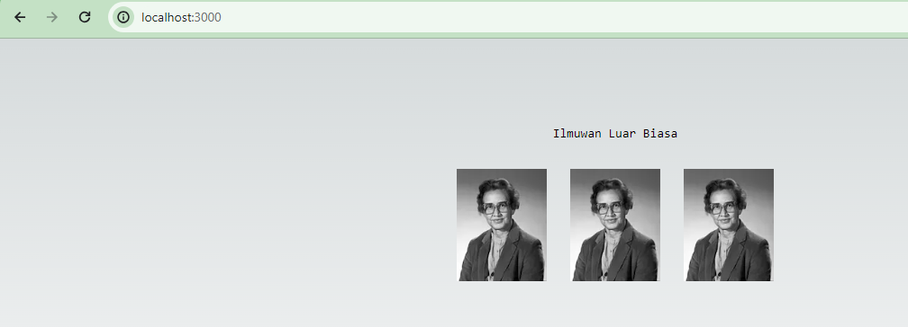
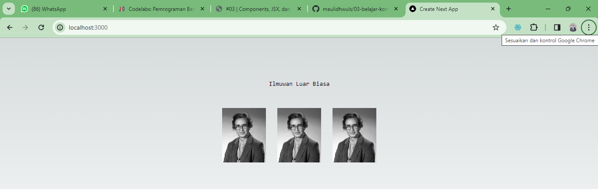
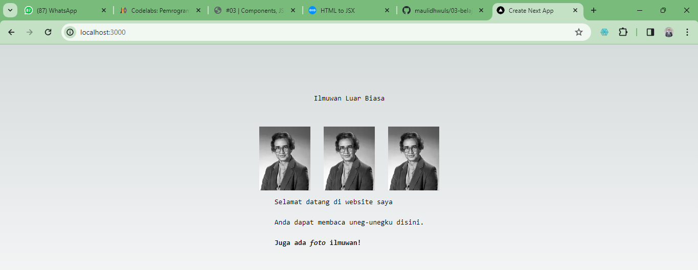
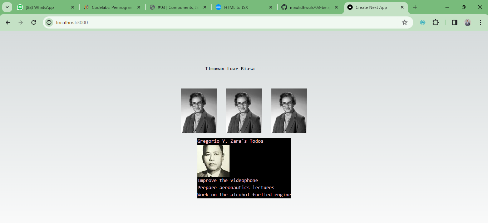

This is a [Next.js](https://nextjs.org/) project bootstrapped with [`create-next-app`](https://github.com/vercel/next.js/tree/canary/packages/create-next-app).

## Getting Started

First, run the development server:

```bash
npm run dev
# or
yarn dev
# or
pnpm dev
# or
bun dev
```

Open [http://localhost:3000](http://localhost:3000) with your browser to see the result.

You can start editing the page by modifying `app/page.tsx`. The page auto-updates as you edit the file.

This project uses [`next/font`](https://nextjs.org/docs/basic-features/font-optimization) to automatically optimize and load Inter, a custom Google Font.

## Laporan 2 Tugas Framework

Nama : Wulan Maulidiah <br>
NIM : 2341728038 <br>
Kelas : TI 3A <br>

1. Untuk mengatasi error tersebut kita harus memasukkan atau menginisiasi domain image karena data image tidak dapat diload di browser, sehingga kita harus memasukkan url image yang digunakan pada file profile.tsx ke dalam file next.config.mjs.


2. Pada kasus nomor 2 ini, kita melakukan import komponen yang disebut dengan "named import", yang mana dalam melakukan named import kita bisa memilih nilai mana yang akan diimport. Dalam hal ini kita hanya mengimpor nilai yang diberi nama 'Gallery' dari file gallery.tsx. Jadi bisa saja kita memiliki nilai komponen yang berbeda dalam 1 file komponen. Untuk tampilannya sama dengan tampilan yang nomor 1, karena pada file Gallery.tsx kita mengimport komponen profile.


3. Terdapat beberapa error dalam kode program tersebut, yang pertama tidak terdapat tag parent jadi solusinya saya menggunakan tag kosong (fragment). Error kedua yaitu penggunaan camelCase. Ketiga, Penggunaan `<br/>` untuk mengakhiri baris baru. Keempat, menutup tag `<b>` dan `<i>` dengan posisi yang benar.


4. 

5. Setelah melakukan import komponen TodoList terjadi perubahan pada browser dengan muncul tampilan Todolist dari Gregorio Y. Zara



## Deploy on Vercel

The easiest way to deploy your Next.js app is to use the [Vercel Platform](https://vercel.com/new?utm_medium=default-template&filter=next.js&utm_source=create-next-app&utm_campaign=create-next-app-readme) from the creators of Next.js.

Check out our [Next.js deployment documentation](https://nextjs.org/docs/deployment) for more details.
